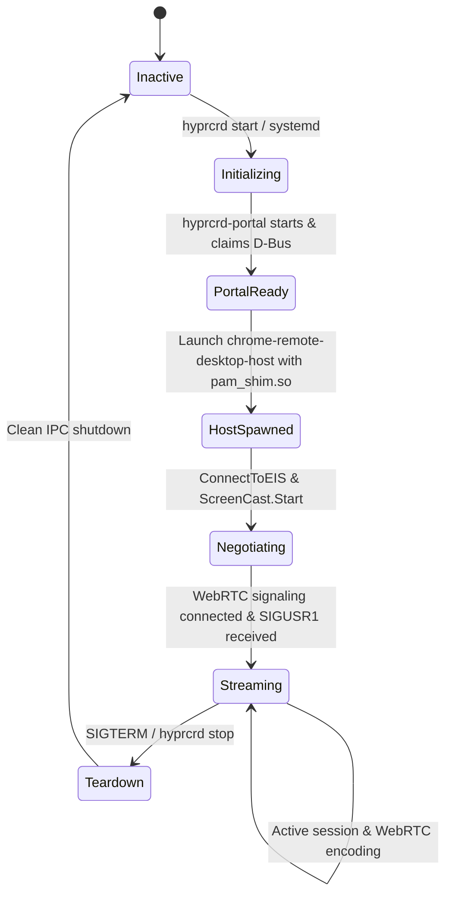

# Architectural Specification: hyprCRD (HyperCRD)
**Native Wayland & PipeWire Host Implementation for Google Chrome Remote Desktop**

---

## Executive Architectural Summary

`hyprCRD` provides a zero-overhead, production-grade integration layer enabling Google Chrome Remote Desktop (CRD) to operate natively within the **Hyprland Wayland compositor**. Unlike legacy implementations that confine remote sessions to synthetic, low-fidelity virtual X11 framebuffers (`Xvfb`) running window managers like Fluxbox, `hyprCRD` bridges CRD's WebRTC remoting engine directly to the host's hardware-accelerated desktop session.

```
┌──────────────────────────────────────────────────────────────────────────────────┐
│                             Client Device (Android, iOS, Web)                    │
└────────────────────────────────────────┬─────────────────────────────────────────┘
                                         │ WebRTC / FTL Signaling
                                         ▼
┌──────────────────────────────────────────────────────────────────────────────────┐
│                   Google Remoting Core (chrome-remote-desktop-host)              │
│                           Dynamically linked to libremoting_core.so              │
└───────────────────┬──────────────────────────────────────────────┬───────────────┘
                    │                                              │
         PipeWire ScreenCast Streams                   RemoteDesktop D-Bus Calls
                    │                                              │
                    ▼                                              ▼
┌───────────────────────────────────────┐      ┌───────────────────────────────────┐
│        pam_shim.so (Preload)          │      │   hyprcrd-portal (D-Bus Bridge)   │
│  - Blocks pw renegotiation on resize  │      │  - org.freedesktop.impl.portal... │
│  - Rewrites cursor_mode (4 -> 2)      │      │  - ConnectToEIS Session Manager   │
│  - Rootless PAM auth bypass           │      │  - System XKB Keymap Compiler     │
└───────────────────┬───────────────────┘      └─────────────────┬─────────────────┘
                    │                                            │
        Direct DMA-BUF / SHM Stream                   EIS Protocol / Wayland Virtual
                    │                                            │
                    ▼                                            ▼
┌──────────────────────────────────────────────────────────────────────────────────┐
│                          Hyprland Wayland Compositor                             │
│                  - xdg-desktop-portal-hyprland (ScreenCast)                      │
│                  - zwlr_virtual_pointer_v1 (Mouse / Scroll)                      │
│                  - zwp_virtual_keyboard_v1 (Keys / Modifiers)                    │
└──────────────────────────────────────────────────────────────────────────────────┘
```

---

## 1. Subsystem Deconstruction

### 1.1. Core Remoting Engine & Binary Interop
The upstream Google Chrome Remote Desktop Linux host (`chrome-remote-desktop-host`) is a proprietary C++ binary compiled against Chromium's WebRTC stack. It contains:
- **WebRTC Transport**: VP8, VP9, and AV1 video encoding, Opus audio encoding, and SCTP data channels.
- **Signaling Layer**: Google FTL (Fast Tracked Link) XMPP-over-HTTPS signaling for peer-to-peer STUN/TURN traversal.
- **Authentication**: SRP (Secure Remote Password) protocol verified against client PIN and OAuth tokens.

`hyprCRD` preserves binary compatibility with `libremoting_core.so` by running the official executable without binary patching, instead supplying an operating environment that transparently routes its I/O into native Wayland subsystems.

---

### 1.2. Rootless PAM Authentication & PipeWire Protection Shim (`pam_shim.so`)

The preload shim (`core/pam_shim.c`) intercepts dynamic symbol lookups (`dlsym`, `dlvsym`) and critical runtime interfaces to solve three architectural hurdles:

#### A. Rootless Authentication Bypass
Standard CRD calls `pam_start` and `pam_acct_mgmt` on the `chrome-remote-desktop` PAM service. When run without `setuid root`, PAM rejects account management checks (`PAM_AUTH_ERR`). `pam_shim.so` hooks `pam_start`, tracks handles matching `chrome-remote-desktop`, and returns `PAM_SUCCESS` directly from `pam_acct_mgmt` in user space.

#### B. PipeWire Stream Renegotiation Protection
When mobile or variable-geometry clients connect, the client emits a `ClientResolution` packet (e.g. 1440x2560 on mobile). Upstream CRD invokes `pw_stream_update_params` on active capture streams to request compositor-side resizing. Because physical monitor streams on Wayland cannot dynamically reshape physical outputs, PipeWire's graph rejects the renegotiation (`no more input formats`), crashing the stream after the initial keyframe.

`pam_shim.so` checks `pw_stream_get_state`. If the stream is in `PW_STREAM_STATE_STREAMING` (3), the renegotiation call is dropped safely, returning `0`. WebRTC's client-side scaler handles display fitting and downscaling smoothly without dropping the 60 FPS hardware capture pipeline.

#### C. Cursor Mode Transpilation
CRD specifies `cursor_mode = 4` (`METADATA`) during `ScreenCast.SelectSources`. `xdg-desktop-portal-hyprland` only advertises support for `EMBEDDED` (2) and `HIDDEN` (1). `pam_shim.so` intercepts `g_dbus_connection_call` and rewrites `cursor_mode` from 4 to 2, ensuring seamless compatibility.

---

### 1.3. The Portal Bridge (`hyprcrd-portal`)

`hyprcrd-portal` implements the Freedesktop RemoteDesktop backend specification (`org.freedesktop.impl.portal.RemoteDesktop`) over D-Bus using `sdbus-c++`.

#### Key Responsibilities:
1. **Paired ScreenCast Session Binding**: When `CreateSession` and `Start` are called, `hyprcrd-portal` initiates a concurrent `ScreenCast` session via `xdg-desktop-portal-hyprland`, extracts the resulting PipeWire stream Node IDs, and injects them into CRD's response map.
2. **EIS Socket Negotiation (`ConnectToEIS`)**: Sets up an Emulated Input System (`libeis`) context, exposes client file descriptors, and registers virtual input seats (`hyprland-portal-seat`).
3. **Hardware Display Geometry Mapping**: Queries `hyprctl monitors -j` at startup to obtain monitor resolution, position offset, and HiDPI scaling, injecting valid physical coordinate boundaries into the EIS device definitions.

---

### 1.4. Input Subsystem & 1:1 Parity

Input translation operates across two Wayland unstable protocols:

| Device | Protocol | Input Events Supported |
| :--- | :--- | :--- |
| **Pointer** | `zwlr_virtual_pointer_v1` | Relative motion, absolute coordinates, primary/secondary/middle/back/forward buttons, discrete wheel clicks, continuous scroll deltas. |
| **Keyboard** | `zwp_virtual_keyboard_v1` | Scancode injection, dynamic system XKB keymap synthesis, modifier state tracking (Shift, Ctrl, Alt, Super/Meta, CapsLock, NumLock). |

#### Dynamic Keymap Compilation
To support the full range of client keyboards (including mobile function-key overlays and international layouts), `hyprcrd-portal` initializes `libxkbcommon` with the host's active locale:
```cpp
struct xkb_rule_names names = {};
struct xkb_keymap* km = xkb_keymap_new_from_names(ctx, &names, XKB_KEYMAP_COMPILE_NO_FLAGS);
```
The compiled keymap string is uploaded to compositor shared memory (`memfd_create`) and bound via `zwp_virtual_keyboard_v1_keymap`, ensuring 100% keycode parity between Android/iOS CRD clients and Hyprland.

---

## 2. Process Lifecycle & State Machine



---

## 3. Sandboxing & Isolation Constraints

- **Headless Sandbox Testing**: `test/run_isolated_test.sh` spawns a fully isolated, nested Hyprland compositor on `/run/user/1000/wayland-2` with `isolated-hyprland.conf`. This enables continuous integration and automated end-to-end verification without interfering with the developer's live workstation display.
- **Rootless Operation**: No component requires root privileges, setuid binaries, or custom kernel modules.
