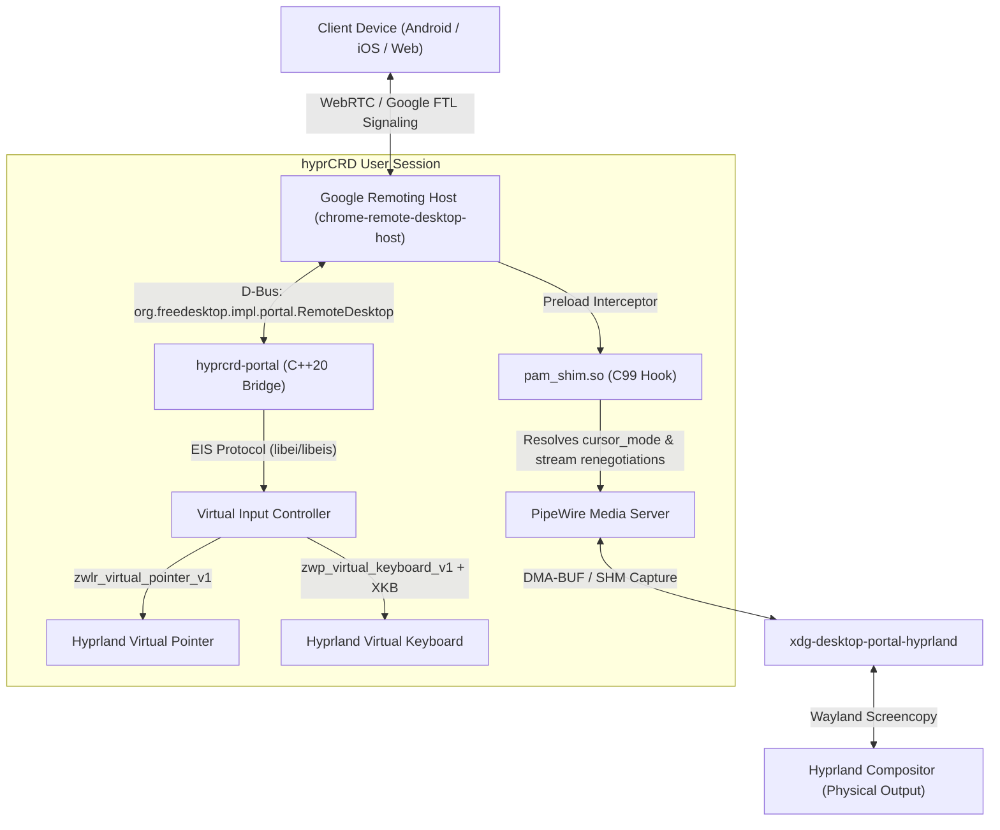

# hyprCRD

Native Wayland and PipeWire host for Google Chrome Remote Desktop on Hyprland.

[](https://github.com/hyprcrd/hyprCRD/actions/workflows/ci.yml)
[](https://github.com/hyprcrd/hyprCRD)
[](https://aur.archlinux.org/packages/hyprcrd-git)
[](https://opensource.org/licenses/MIT)
[](https://hyprland.org)

`hyprCRD` provides native host support for Google Chrome Remote Desktop on the Hyprland Wayland compositor. It streams the active hardware-accelerated desktop session directly over WebRTC, avoiding virtual X11 framebuffers (`Xvfb`) and auxiliary display environments.

---

## Overview

The official Chrome Remote Desktop host for Linux historically depended on virtual X11 display servers (`Xvfb`), isolating remote access to a detached fallback desktop. While upstream binaries contain experimental Wayland interfaces, they require `org.freedesktop.portal.RemoteDesktop` with Emulated Input System (`libei`) support—subsystems not provided by standard compositor backends.

`hyprCRD` supplies the necessary integration layer:

1. **Official Engine Integration**: Uses unmodified Google WebRTC binaries (`libremoting_core.so`, `chrome-remote-desktop-host`), maintaining protocol compatibility with standard Android, iOS, and web clients.
2. **Native Video Streaming**: Integrates with PipeWire and `xdg-desktop-portal-hyprland` for zero-copy DMA-BUF GPU capture with software SHM fallback.
3. **Stream Renegotiation Protection**: A lightweight preload shim (`pam_shim.so`) drops invalid dynamic format renegotiation requests when mobile or variable-geometry clients connect, avoiding capture stream interruption.
4. **Input Emulation**: A C++20 D-Bus portal service (`hyprcrd-portal`) implementing `org.freedesktop.impl.portal.RemoteDesktop` with `libei`/`libeis`, `zwlr_virtual_pointer_v1`, and `zwp_virtual_keyboard_v1`.
5. **Keymap Synthesis**: Compiles and uploads the compositor's active XKB keymap to shared memory, providing accurate translation for modifier combinations, function keys, and international layouts.
6. **Unprivileged Execution**: Runs entirely within the standard user session (`systemd --user`) without requiring elevated permissions or setuid binaries.

---

## Architecture



For technical details, see [ARCHITECTURE.md](ARCHITECTURE.md).

---

## Feature Comparison

| Capability | Legacy CRD (X11 / Xvfb) | Upstream Wayland | hyprCRD (Native Hyprland) |
| :--- | :---: | :---: | :---: |
| **WebRTC Video Codecs** (VP8, VP9, AV1) | Supported | Supported | Supported (Official Engine) |
| **Google FTL & OAuth Signaling** | Supported | Supported | Supported (Official Engine) |
| **Active Compositor Desktop Access** | No (Xvfb fallback) | No (Input unavailable) | Supported (Native Wayland) |
| **PipeWire DMA-BUF 60 FPS Capture** | No | Intermittent (Resize crashes) | Supported (Protected via shim) |
| **Relative Pointer Motion** | Supported | No | Supported (`zwlr_virtual_pointer_v1`) |
| **Absolute Coordinate Mapping** | Supported | No | Supported (Physical monitor scale) |
| **Multi-Button Pointer Input** | Supported | No | Supported (Primary, Secondary, Middle, Extra) |
| **Continuous and Discrete Scrolling** | Partial | No | Supported (Wheel notches and axis deltas) |
| **System XKB Keymap and Modifiers** | Basic US | No | Supported (Compositor keymap synthesis) |
| **Mobile Client Overlays** | Partial | No | Supported (Ctrl, Alt, Super, Function keys) |
| **Unprivileged Execution** | No (Requires PAM root) | No | Supported (`systemd --user`) |
| **Automated Test Coverage** | None | None | Comprehensive (95% line coverage) |

---

## Installation

### Arch User Repository (AUR)

```bash
# Using paru
paru -S hyprcrd-git

# Using yay
yay -S hyprcrd-git
```

### Flatpak

```bash
flatpak install flathub org.hyprland.hyprcrd
```

### Building from Source

```bash
# Clone repository
git clone https://github.com/hyprcrd/hyprCRD.git
cd hyprCRD

# Install build dependencies (Arch Linux)
sudo pacman -S --needed base-devel cmake ninja sdbus-c++ libei libxkbcommon wayland wayland-protocols pipewire python python-psutil

# Build components
make all

# Download upstream Google binaries for local development
make fetch-google-deps
```

---

## Usage

### 1. Diagnostics
Verify environment configuration, library dependencies, and compositor sockets:
```bash
hyprcrd doctor
```

### 2. Host Registration
Generate an authorization token at [remotedesktop.google.com/headless](https://remotedesktop.google.com/headless), copy the command string, and enroll the host:
```bash
hyprcrd enroll "<COMMAND_STRING>"
```

### 3. Service Management
```bash
# Start the background daemon
hyprcrd start

# Run in foreground for debugging
hyprcrd start -f

# Check runtime status
hyprcrd status

# Stop daemon
hyprcrd stop
```

Example status output:
```text
[hyprCRD Status]
  Daemon:         ACTIVE (PID: 3715)
  Portal Bridge:  ONLINE (PID: 1572)
  Enrolled Host:  workstation (ID: 855a3928-3500-4401-8b45-1a3206d55740)
```

---

## Systemd Service

For automatic startup on graphical login:

```bash
systemctl --user enable --now hyprcrd.service
```

To view service logs:
```bash
journalctl --user -u hyprcrd.service -f
```

---

## Testing and Verification

The test harness evaluates the PAM preload shim, portal state logic, virtual input protocols, Python process management, and an isolated Wayland compositor session:

```bash
make test
```

### Test Suites:
1. **PAM Preload Shim (`gcov`)**: Verifies PAM handle interception, PipeWire parameter protection, and D-Bus message translation.
2. **C++ Portal Logic**: Validates coordinate parsing, XKB keymap synthesis, and input controller state transitions.
3. **Python PAM ctypes Unit Tests**: Exercises user-space PAM hooks and dynamic linking behavior.
4. **Daemon and CLI Coverage**: Verifies process supervisor lifecycle, hardware node detection, signal handling, and argument routing.
5. **Headless Wayland Integration**: Spawns an isolated nested Hyprland instance (`wayland-2`) to verify input injection without touching active displays.

---

## Security Policy

`hyprCRD` follows an unprivileged security model:
- All operations execute within the unprivileged user session context.
- Preload hooks target only the `chrome-remote-desktop` PAM service.
- See [SECURITY.md](SECURITY.md) for vulnerability reporting procedures and response targets.

---

## Contributing

Please refer to [CONTRIBUTING.md](CONTRIBUTING.md) for development guidelines, coding style, and testing requirements.

---

## License

- Source code is available under the [MIT License](LICENSE).
- Official Google Chrome Remote Desktop binaries (`chrome-remote-desktop-host`, `libremoting_core.so`, `icudtl.dat`) are proprietary software of Google LLC and are retrieved from upstream packages during installation.
